# Authentifizierung & Session-Management

## 🔐 Übersicht

NoteNest verwendet ein JWT-basiertes Authentifizierungssystem mit Refresh-Tokens für sichere und komfortable Benutzerverwaltung.

## 📋 Features

### ✅ "Angemeldet bleiben" Funktionalität

Beim Login kann der Benutzer wählen, ob er angemeldet bleiben möchte:

| Option | Storage | Gültigkeit | Verhalten |
|--------|---------|------------|-----------|
| **✅ Haken gesetzt** | `localStorage` | 7 Tage | Bleibt eingeloggt, auch nach Browser-Neustart |
| **❌ Haken nicht gesetzt** | `sessionStorage` | Browser-Sitzung | Logout beim Schließen des Browser-Tabs |

### 🔑 Token-System

#### Access Token
- **Gültigkeit**: 15 Minuten
- **Verwendung**: API-Authentifizierung
- **Erneuerung**: Automatisch durch Refresh Token

#### Refresh Token
- **Gültigkeit**: 7 Tage
- **Verwendung**: Access Token erneuern
- **Speicherung**: localStorage (persistieren) oder sessionStorage (Sitzung)

#### Automatische Token-Erneuerung

```typescript
// Access Token läuft ab → Automatisch erneuert durch Refresh Token
// User merkt nichts davon - nahtlose Erfahrung
```

**Ablauf:**
1. Access Token (15 Min) läuft ab
2. API-Request schlägt mit 401 fehl
3. Frontend holt neuen Access Token mit Refresh Token
4. Request wird automatisch wiederholt
5. User bleibt eingeloggt

### 🔒 Sicherheit

#### Rate Limiting

Schutz vor Brute-Force-Angriffen:

| Umgebung | Login-Versuche | Zeitfenster | Registrierung |
|----------|----------------|-------------|---------------|
| **Development** | 20 | 5 Minuten | 10 / Stunde |
| **Production** | 5 | 15 Minuten | 3 / Stunde |

#### Passwort-Hashing

- **Algorithmus**: Argon2id
- **Standard**: OWASP-Empfehlungen
- **Salting**: Automatisch pro User

#### JWT-Secrets

- **Generierung**: Automatisch beim ersten Start (falls nicht vorhanden)
- **Länge**: Mindestens 64 Zeichen (Production)
- **Speicherung**: `.env` Datei (nicht im Repository)

```bash
# Manuelle Generierung (optional)
openssl rand -base64 64
```

## 🔄 Session-Lifecycle

### Login-Flow


### Token-Refresh-Flow

```mermaid
sequenceDiagram
    Frontend->>Backend: API-Request (mit abgelaufenem Access Token)
    Backend-->>Frontend: 401 Unauthorized
    Frontend->>Backend: POST /api/auth/refresh (mit Refresh Token)
    Backend->>Backend: Validiere Refresh Token
    Backend-->>Frontend: { accessToken }
    Frontend->>Storage: Speichere neuen Access Token
    Frontend->>Backend: Wiederhole ursprünglichen Request
    Backend-->>Frontend: Erfolgreiche Antwort
```



### Logout-Flow

```mermaid
sequenceDiagram
    User->>Frontend: Logout
    Frontend->>Backend: POST /api/auth/logout (mit Refresh Token)
    Backend->>Backend: Invalidiere Refresh Token
    Backend-->>Frontend: 200 OK
    Frontend->>Storage: Lösche Tokens (beide Storages)
    Frontend->>User: Redirect zu /login
```



## 🛠️ Implementierung

### Frontend (React + Zustand)

**Store: `frontend/src/store/authStore.ts`**

```typescript
// Initial State
{
  user: null,
  isAuthenticated: false,
  isLoading: true, // Wichtig: initial true für App-Start
  error: null
}

// Login
login({ username, password, rememberMe }) {
  const storage = rememberMe ? localStorage : sessionStorage;
  storage.setItem('accessToken', response.accessToken);
  storage.setItem('refreshToken', response.refreshToken);
  localStorage.setItem('useSessionStorage', rememberMe ? 'false' : 'true');
}

// CheckAuth (beim App-Start)
checkAuth() {
  const useSessionStorage = localStorage.getItem('useSessionStorage') === 'true';
  const storage = useSessionStorage ? sessionStorage : localStorage;
  // ... Token-Validierung
}
```

### Backend (Express + JWT)

**Controller: `backend/src/controllers/auth.controller.ts`**

```typescript
// Login
export async function login(req: Request, res: Response) {
  const { username, password } = req.body;
  
  // 1. User finden
  const user = findUserByUsername(username);
  
  // 2. Passwort verifizieren (Argon2id)
  const isValid = await verifyPassword(password, user.password_hash);
  
  // 3. Tokens generieren
  const accessToken = generateAccessToken(user);
  const refreshToken = generateRefreshToken(user);
  
  // 4. Refresh Token in DB speichern
  saveRefreshToken(user.id, refreshToken);
  
  // 5. Response
  res.json({ accessToken, refreshToken, user });
}
```

**Middleware: `backend/src/middleware/auth.middleware.ts`**

```typescript
export const authenticateToken = async (req, res, next) => {
  const token = req.headers.authorization?.split(' ')[1];
  
  if (!token) {
    return res.status(401).json({ error: 'No token provided' });
  }
  
  try {
    const decoded = verifyAccessToken(token);
    req.user = await getUserById(decoded.userId);
    next();
  } catch (error) {
    return res.status(403).json({ error: 'Invalid token' });
  }
};
```

## 🧪 Testing

### Manuelle Tests

**Test 1: "Angemeldet bleiben" aktiviert**
```bash
# 1. Login mit Haken
# 2. Reload (F5) → ✅ Bleibt eingeloggt
# 3. Browser schließen und neu öffnen → ✅ Bleibt eingeloggt
# 4. Nach 7 Tagen → ❌ Muss sich neu anmelden
```

**Test 2: "Angemeldet bleiben" deaktiviert**
```bash
# 1. Login ohne Haken
# 2. Reload (F5) → ✅ Bleibt eingeloggt (Sitzung aktiv)
# 3. Tab schließen und neu öffnen → ❌ Muss sich neu anmelden
```

**Test 3: Token-Refresh**
```bash
# 1. Login
# 2. Warte 16 Minuten (Access Token abgelaufen)
# 3. API-Request machen → ✅ Automatisch erneuert, kein Logout
```

**Test 4: Rate Limiting**
```bash
# Development:
# 1. 5 falsche Login-Versuche → ✅ Klappt noch
# 2. 20 falsche Login-Versuche → ❌ "Too many attempts"
# 3. Warte 5 Minuten → ✅ Kann wieder versuchen
```

### Automatisierte Tests

```bash
# Unit Tests
cd backend
npm test -- auth.service.test.ts

# Integration Tests
npm test -- auth.integration.test.ts
```

## ⚙️ Konfiguration

### Environment Variables

**.env**
```bash
# JWT-Secrets (automatisch generiert beim ersten Start)
JWT_SECRET=<generiert-64-chars>
JWT_REFRESH_SECRET=<generiert-64-chars>

# Token-Gültigkeit (optional, Defaults werden verwendet)
JWT_ACCESS_EXPIRES_IN=15m   # Access Token: 15 Minuten
JWT_REFRESH_EXPIRES_IN=7d   # Refresh Token: 7 Tage
```

### Token-Gültigkeit anpassen

**Datei: `backend/src/config/constants.ts`**

```typescript
export const JWT_ACCESS_TOKEN_EXPIRY = '15m';   // 15 Minuten
export const JWT_REFRESH_TOKEN_EXPIRY = '7d';   // 7 Tage
```

**Mögliche Werte:**
- `15m` = 15 Minuten
- `1h` = 1 Stunde
- `1d` = 1 Tag
- `7d` = 7 Tage
- `30d` = 30 Tage

**Empfehlungen:**
- **Access Token**: 15m - 1h (kurz für Sicherheit)
- **Refresh Token**: 7d - 30d (lange genug, aber nicht zu lange)

## 🔧 Troubleshooting

### Problem: User wird nach Reload ausgeloggt

**Ursache:** Alte Tokens im falschen Storage

**Lösung:**
```javascript
// Browser Console öffnen (F12)
localStorage.clear()
sessionStorage.clear()
location.reload()
```

### Problem: "Too many login attempts"

**Ursache:** Rate Limiting aktiv

**Lösung (Development):**
```bash
# Container neustarten (Reset Rate Limit)
docker restart notenest-dev
```

### Problem: "Invalid token" Fehler

**Mögliche Ursachen:**
1. JWT-Secret wurde geändert (Backend-Neustart mit neuer .env)
2. Token manuell gelöscht/modifiziert
3. System-Zeit nicht synchron (Clock Skew)

**Lösung:**
- Neu anmelden
- System-Zeit prüfen

## 📊 Monitoring

### Logs prüfen

```bash
# Docker Logs
docker logs notenest-dev --tail 50 | grep -i "auth"

# Log-Dateien
tail -f logs/notenest.log | grep "auth"
```

### Metrics

```bash
# Prometheus Metrics
curl http://localhost:3000/api/metrics | grep auth
```

## 🔐 Best Practices

### Für Entwickler

✅ **DO:**
- Verwende `checkAuth()` nur beim App-Start
- Speichere Tokens nie im Code
- Verwende HTTPS in Production
- Implementiere Token-Refresh vor API-Calls
- Logge sensible Daten nicht (Passwörter, Tokens)

❌ **DON'T:**
- Tokens in URL-Parameter
- Tokens in localStorage ohne Verschlüsselung (wenn XSS-Risiko)
- Rate Limiting in Production deaktivieren
- JWT-Secrets committen

### Für Administratoren

✅ **DO:**
- JWT-Secrets regelmäßig rotieren (z.B. jährlich)
- HTTPS verwenden (Let's Encrypt)
- Reverse Proxy mit Rate Limiting
- Monitoring aktivieren
- Backups der Datenbank

❌ **DON'T:**
- Standard-Passwörter verwenden
- JWT-Secrets öffentlich zugänglich machen
- Rate Limiting deaktivieren
- Logs in Production-Umgebung ignorieren

## 📚 Weitere Dokumentation

- [API-Endpunkte](./API.md)
- [Deployment-Anleitung](../DEPLOYMENT_ANLEITUNG.md)
- [Troubleshooting](./TROUBLESHOOTING.md)
- [Architektur](../ARCHITEKTUR_PLANUNG.md)

